# ✈️ SJ Travels NextJS

[](https://nextjs.org/)
[](https://react.dev/)
[](https://www.typescriptlang.org/)
[](https://tailwindcss.com/)
[](https://ui.shadcn.com/)
[](https://zod.dev/)
[](https://react-hook-form.com/)
[](https://lucide.dev/)

**A premium, high-performance travel booking platform built for speed, SEO, and a seamless user experience.**

---

🌐 **Book a trip to tirupati :** [Live Demo](https://sjtravelsnext.vercel.app/)

---

## 🌟 Overview
**SJ Travels NextJS** is a modern web application designed to digitize the travel experience for users seeking temple tours, homestays, and vehicle rentals.

It leverages the power of **Next.js v15** and **React Server Components** to deliver near-instant page loads. The UI is crafted with **Shadcn/ui** and **Tailwind CSS**, ensuring accessibility and a stunning, responsive design that looks great on any device.

---

## 🚀 The "Next.js" Architecture
*(How it works under the hood)*

This project isn't just a website; it's a **hybrid web application** powered by the **Next.js App Router**. Here is the techy breakdown of how it works in simple language:

* **Server-First Rendering (RSC):** Pages are pre-rendered on the server using React Server Components, allowing instant content delivery with minimal client-side JavaScript.
* **Smart Hydration:** We use a technique called "Partial Hydration". The static parts (like text and images) are sent as pure HTML. The interactive parts (like the Navbar and Carousels) are "hydrated" (activated) separately. This makes the site feel incredibly fast.
* **Route Groups & Layouts:** Shared layouts via `layout.tsx` keep persistent UI mounted while only route content updates, enabling fast, seamless navigation.
* **Image Optimization:** All images (`Next/Image`) are automatically resized and converted to modern formats like WebP/AVIF by the Next.js server, preventing layout shifts and saving data for mobile users.

---

## ⚡ Features
-   **Dynamic Fleet Showcase:** Browse luxury buses, tempos, and cars with fluid animations.
-   **Interactive Carousels:** Built with **Embla Carousel**, allowing touch-friendly swiping through testimonials and hero images.
-   **Temple & Homestay Discovery:** Dedicated sections for exploring local attractions with rich media cards.
-   **Adaptive Mobile Intelligence:** Utilizes a custom **useIsMobile** hook with media query listeners to programmatically switch layouts and navigation behaviors for handheld devices.
-   **SEO Optimized:** Built-in `sitemap.ts` and `robots.ts` ensure Google indexes the site perfectly.
-   **Floating Visual Layer:** Implements a custom **FloatingElement** component to create depth with staggered, delay-controlled entrance animations for a 3D layered effect.

---

## 🎨 UI/UX Design
-   **Glassmorphism & Gradients:** Uses subtle gradient overlays and blur effects for a premium, modern feel.
-   **Motion & Interactivity:** Elements fade in and slide up (`AOS` / `Tailwind Animate`) as you scroll, keeping the user engaged.
-   **Mobile-First Drawers:** On mobile, navigation and details open in native-like "drawers" using the **Vaul** library, providing an app-like feel on the web.
-   **Scroll-Driven Interactivity:** Features custom **Intersection Observer** hooks to render performant, animated statistical counters that trigger smoothly as the user scrolls.

---

## 🛠 Tech Stack
-   **Framework:** Next.js 15 (App Router)
-   **Language:** TypeScript (Strict type safety)
-   **Styling:** Tailwind CSS + Tailwind Animate
-   **Component Library:** Shadcn/ui (Radix UI Primitives)
-   **Icons:** Lucide React
-   **Animations:** Framer Motion / AOS
-   **Forms:** React Hook Form + Zod
-   **Charts:** Recharts (for data visualization)
-   **Utils:** Date-fns, CLSX, Tailwind-Merge

---

## 🖼 Screenshots

### Landing Page
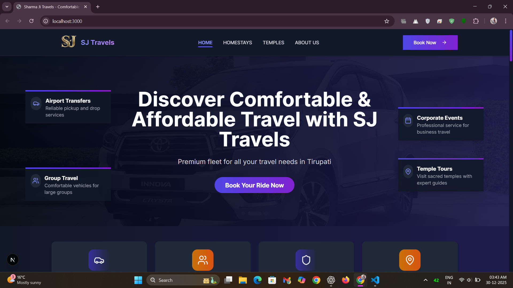
*A modern hero section welcoming users with a premium gradient design and clear call to action.*

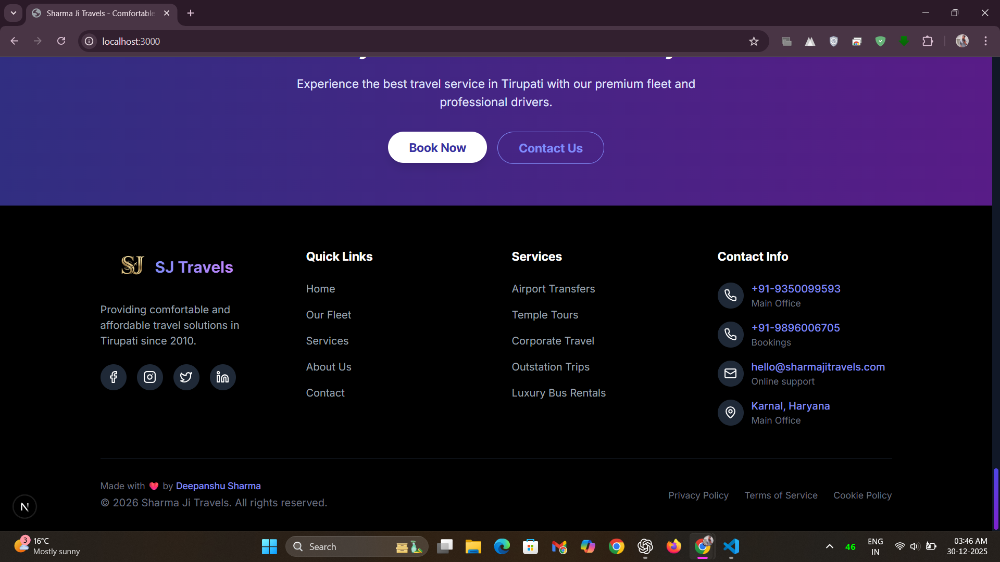
*An alternate landing layout highlighting brand identity and key offerings.*

### Services Overview
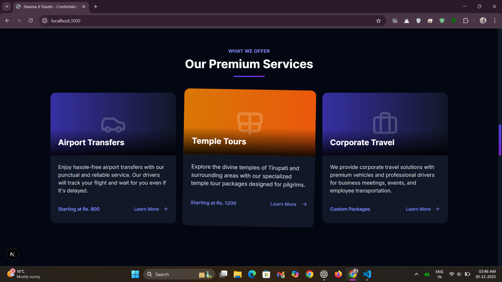
*A structured grid layout showcasing core services like airport transfers and tour packages.*

### Vehicle Fleet
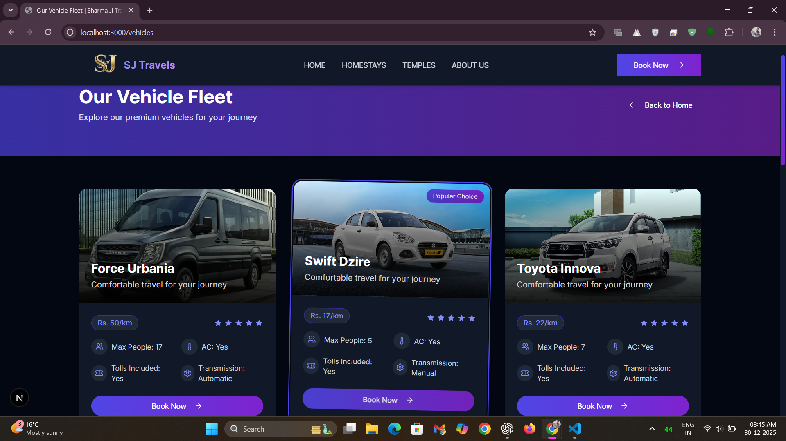
*Interactive cards displaying luxury buses, tempos, and cars with detailed specifications.*

### Temple Tours
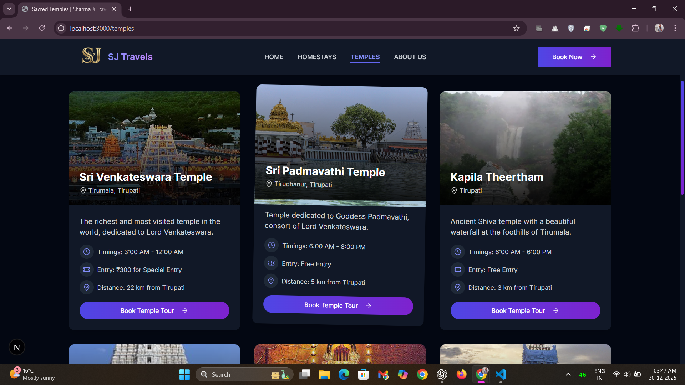
*Visually rich cards designed to explore spiritual destinations and curated temple tours.*

### Homestays
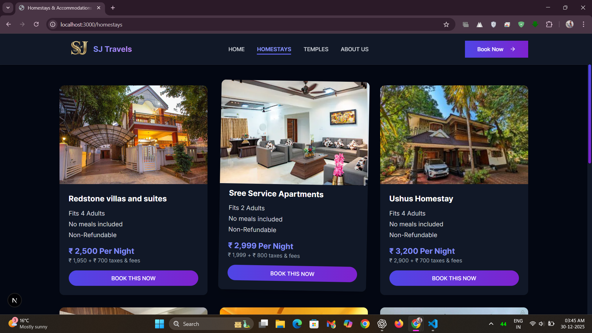
*A dedicated section presenting comfortable homestay options with amenities and pricing.*

### About Us
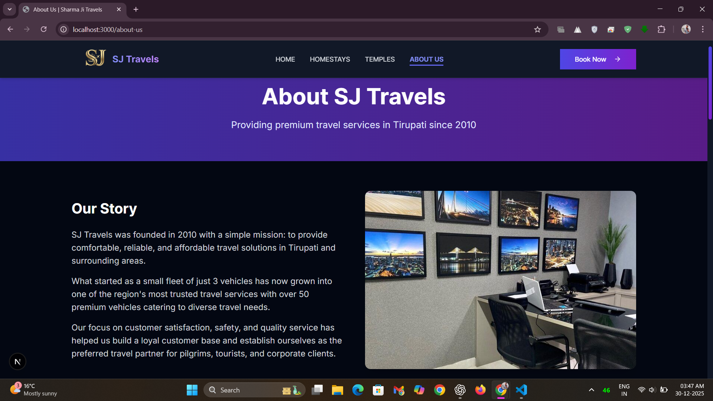
*Detailed information about the agency’s background, mission, and service philosophy.*

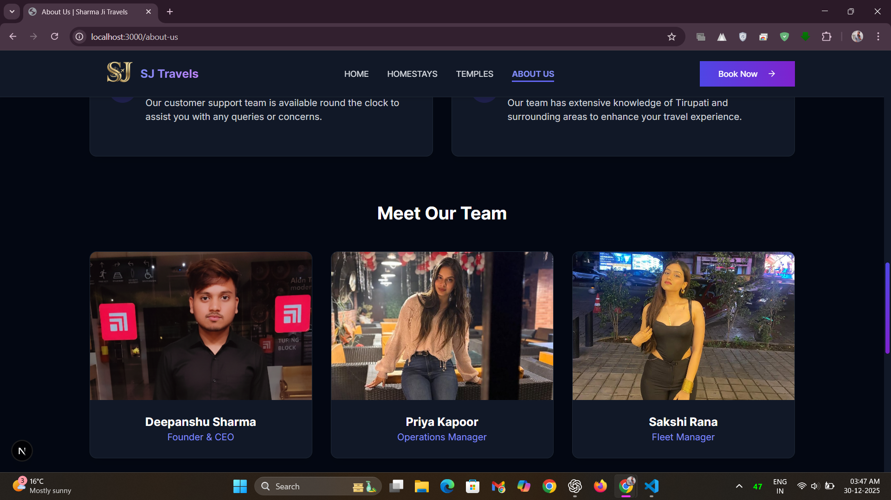
*An expanded layout focusing on company values and long-term vision.*

### Customer Testimonials
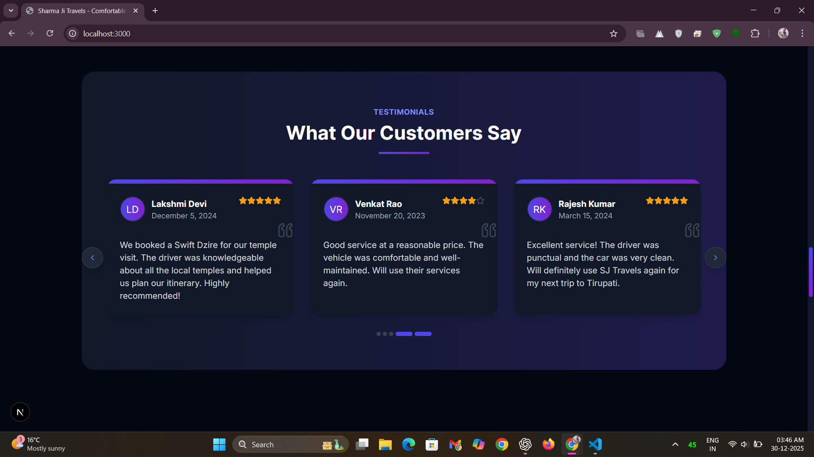
*Real customer feedback displayed in a responsive, touch-friendly carousel.*

### Responsive Design
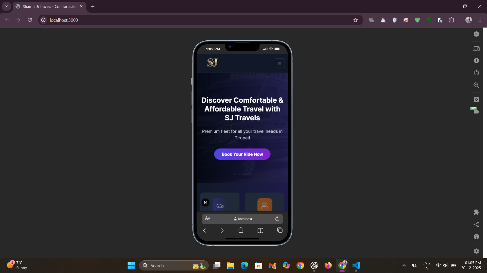
*Mobile-first layout optimized for smaller screens.*

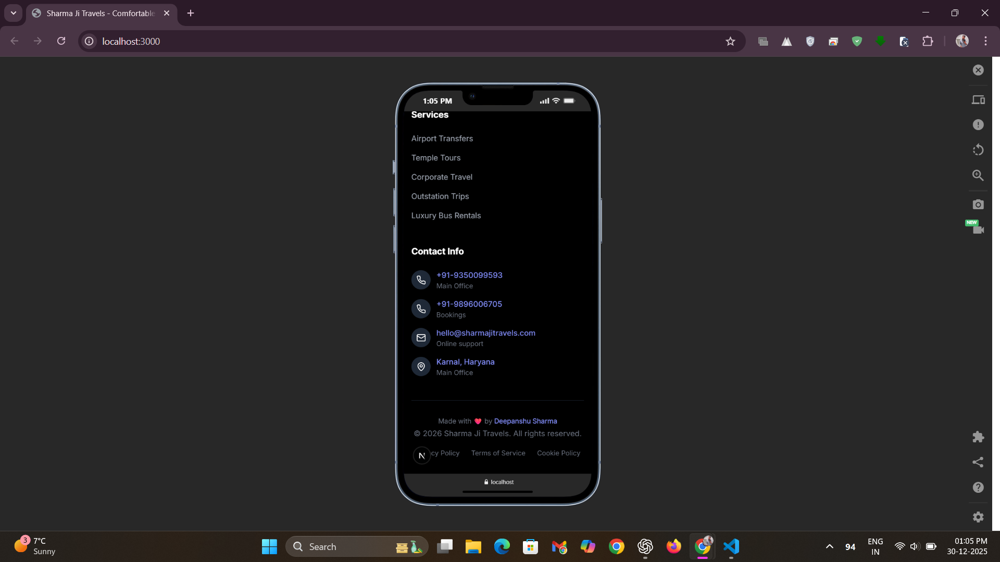
*Showing the brand logo and footer clearly in the mobile layout.*

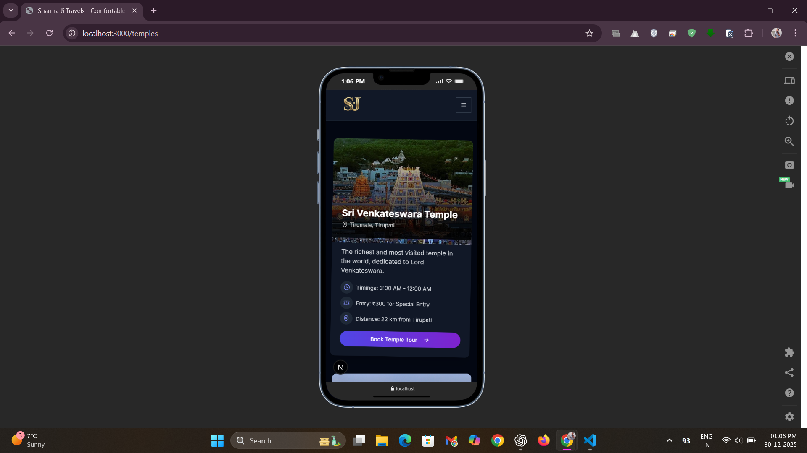
*Fully responsive design ensuring consistency across all device sizes.*

---

## 📌 Installation/Usage

If you want to run this project locally:

```bash
# Clone the repository
git clone <your-repo-link>

# Navigate to the project folder
cd sjTravelsNextJS

# Install dependencies (Use "Legacy Peer Deps" only wih this command if needed due to React v19/Next.js v15 conflicts)
npm install --legacy-peer-deps

# Run the development server
npm run dev